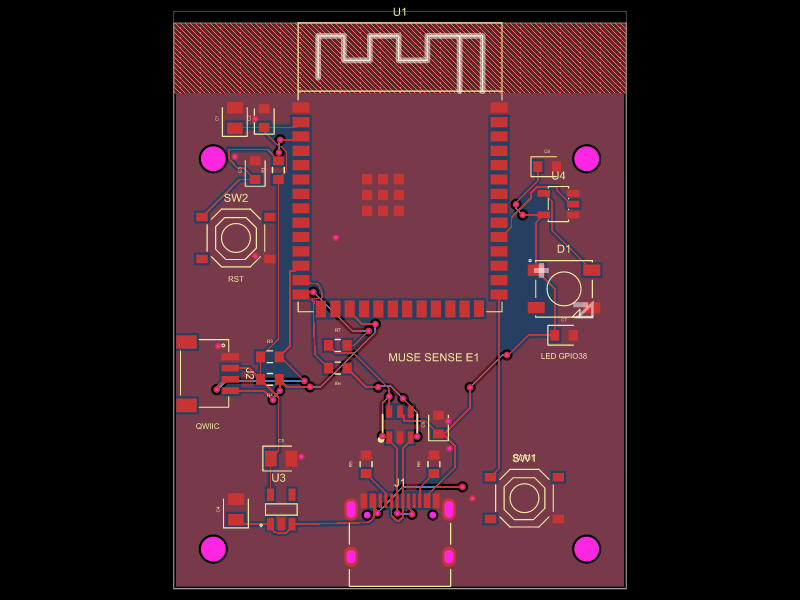

# Muse Sense badge, experiment 1

A minimal ESP32-S3 carrier board for [Muse Gadgets](https://github.com/facebookincubator/muse-gadget-sdk), designed in [tscircuit](https://tscircuit.com). 40 x 50 mm, 2 layers.

- ESP32-S3-WROOM-1-N8R8 (8 MB flash, 8 MB octal PSRAM)
- USB-C for 5 V power and the S3's native USB (GPIO19/20), USBLC6-2SC6 ESD protection
- AP2112K-3.3 LDO (600 mA)
- WS2812B status LED on GPIO38, driven through an SN74AHCT1G125 level shifter
- BOOT button on GPIO0, RESET button on CHIP_PU
- Qwiic / STEMMA QT connector (I2C on GPIO8/GPIO9, 3.3 V)
- 4 x M2 mounting holes

Status: design files only. Nothing has been fabricated or run.



## Firmware

The board runs the Muse ESP32 Device SDK's `espressif-s3-devkitc-1` overlay unchanged. It uses the same module (N8R8) as that board, with the LED on GPIO38, BOOT on GPIO0 and native USB.

| Piece | Where | State |
|---|---|---|
| Configurable LED GPIO (`CONFIG_HOMEHUB_LED_STRIP_GPIO`) | [facebookincubator/muse-gadget-sdk#46](https://github.com/facebookincubator/muse-gadget-sdk/pull/46) | open |
| `espressif-s3-devkitc-1` overlay (LED on 38, GRB, octal PSRAM) | branch `contrib/espressif-s3-devkitc-1` on [ViSaReVe/muse-gadget-sdk](https://github.com/ViSaReVe/muse-gadget-sdk) | built, not opened upstream |

Until both merge, build from that branch:

```sh
cd muse-gadget-sdk/esp32
tools/board.sh espressif-s3-devkitc-1 build
```

That overlay keeps the default UART0 console and adds the USB-Serial-JTAG as a secondary console, so logs appear on this board's USB-C port. The board has no UART bridge.

The SDK has no I2C sensor command yet. The Qwiic port is wired but does nothing until firmware uses it.

## Pin map

| Function | ESP32-S3 | Notes |
|---|---|---|
| USB D- / D+ | GPIO19 / GPIO20 | 22 Ω series resistors, per Espressif's ESP32-S3 schematic checklist |
| Status LED data | GPIO38 | via AHCT buffer to the WS2812B at 5 V |
| BOOT | GPIO0 | button to GND, internal pull-up |
| RESET | CHIP_PU | 10 kΩ / 1 µF delay (checklist values), button to GND |
| I2C SDA / SCL | GPIO8 / GPIO9 | 4.7 kΩ pull-ups to 3.3 V |

The WS2812B needs VIH = 0.7 x VDD = 3.5 V at a 5 V supply, which a 3.3 V GPIO can't reach. The AHCT125 runs from 5 V with a 2.0 V input threshold.

## Files

| Path | What |
|---|---|
| `index.circuit.tsx` | Board: outline, ground pours, antenna keepout, holes |
| `lib/*.tsx` | One file per block: `mcu`, `usb`, `power`, `buttons`, `led`, `qwiic` |
| `lib/parts.ts` | LCSC and manufacturer part numbers for the passives |
| `imports/` | Parts imported with `tsci import --jlcpcb --use-exact-footprint <LCSC>`. Hand edits are commented in the file. |
| `scripts/drc.mjs` | Runs tscircuit's checks plus a local keepout check, writes `outputs/drc.txt` |
| `scripts/drc-selftest.mjs` | Injects faults and confirms the checks report them |
| `scripts/bom.mjs` | Writes `outputs/bom.csv` with LCSC stock and price looked up at run time |
| `outputs/` | Schematic PDF, PCB and 3D renders, BOM, DRC report, Gerbers |

Rebuild everything:

```sh
npm install
npm run outputs
```

## Verified

- **DRC: 0 errors.** 25 named checks from `@tscircuit/checks` 0.0.236 plus `runAllChecks` (0 errors, 0 warnings), on tscircuit 0.0.2743. See [`outputs/drc.txt`](outputs/drc.txt). No routing was edited by hand.
- **The checks fire.** `drc-selftest.mjs` moves a via onto a pad, deletes a trace and pushes a trace off the board; each is reported.
- **Antenna keepout holds:** no copper on either layer under the antenna. `checkPcbCopperOverKeepout` doesn't look at traces in this version, so `drc.mjs` scans trace points itself.
- **Ground pours:** each layer's pour is one connected region (no islands). Vias are 0.3 mm drill / 0.6 mm pad, which avoids JLCPCB's small-via surcharge.
- **BOM:** every line has an LCSC number with stock and qty-1 price from the JLC parts index on 2026-10-03. Parts total about $6.32 per board.
- **Pinouts:** USBLC6-2SC6 pinout taken from independent pinout listings (ST's own PDF wouldn't download here). LED on GPIO38 per Espressif's DevKitC-1 v1.1 guide and IDF's blink example.

## Assumed, not verified

- **Nothing has run on hardware.**
- **LED colour order.** The overlay assumes GRB. If red and green are swapped, flip `CONFIG_HOMEHUB_LED_RGB_ORDER`.
- **Switch pin pairs.** I couldn't get the TS-1187A datasheet. Each switch is wired on diagonal pins (1 to the signal, 4 to GND), which is correct whichever pairs are internally connected. Pins 2 and 3 are left unrouted, which is why the build reports four "missing a trace" warnings. The imported schematic symbol only draws pins 1 and 2, so the schematic carries a note for the pin 4 GND connection.
- **LDO heat.** The AP2112K drops 1.7 V from USB. At 100 mA average that's about 0.17 W; Wi-Fi transmit bursts draw several times more. I haven't modelled the temperature rise. Check it against the datasheet's thermal resistance before putting the board in a closed enclosure.
- **USB signal integrity.** D+/D- are routed on a 2-layer board without impedance control. That's normally fine at USB full speed (12 Mbit/s) but untested here.
- **Antenna performance.** The module sits flush with the top edge with a copper keepout under the antenna, but nothing has been measured.
- **Assembly files.** `outputs/gerbers.zip` includes tscircuit's `pick_and_place.csv`. Its rotations haven't been checked against JLCPCB's assembly preview.
- **3D models** come from EasyEDA through the import.

## tscircuit notes

Things that behaved differently than expected in tscircuit 0.0.2743:

- **Blocks are fragments, not groups.** A `<group>` is moved by the PCB packer as a unit, and its children's `pcbX`/`pcbY` end up relative to wherever it lands. `pcbPositionMode` and `pcbPack={false}` didn't change that. So each block returns a fragment, and every part sits at absolute board coordinates.
- **No `<schematicsheet>`.** Wrapping the parts in one turned on schematic auto-layout and discarded `schX`/`schY`, so the build shows a "no schematicsheet" warning instead.
- **Keepout selectors:** `excludeRefs` takes selectors (`".U1"`), and a keepout without `layers` applies to the top layer only.

## Out of scope for E1

Battery, sensors on the board, an enclosure, a UART header. No fabrication or purchase has been made.
